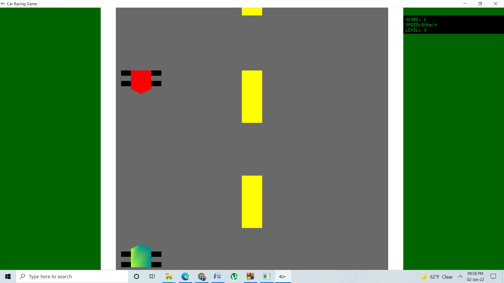
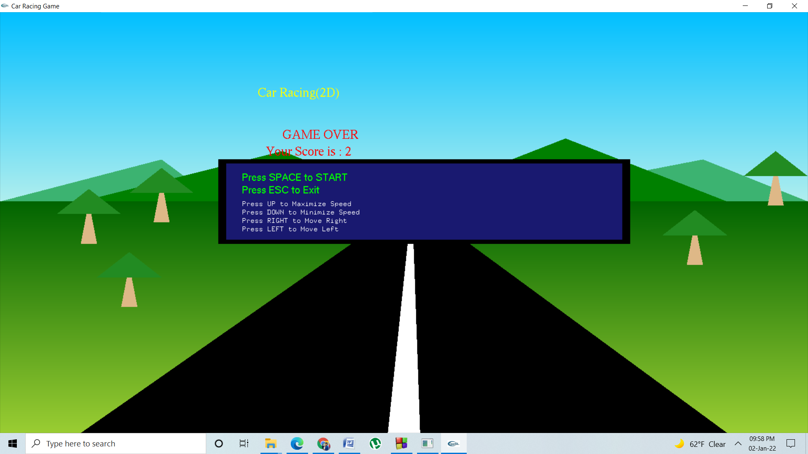

## Project Name

2D Car Racing

## About

A 2D car racing game created using OpenGL and C++.Simple 2D Car racing game with Real Time Score update functionality and Up-down arrow for speed functionality and left-right arrow for car movement and last of all Game Over if crashed by another car.

## Features implemented

1) Tree

2) Road & road border

3) Score board

4) Speed board

5) Level board

6) Moving Car

7) Sky

8) Hills

9) Speed Key 

## Implementation output of my project 

